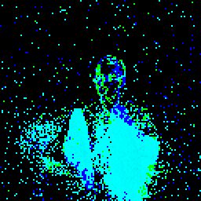

# DVS Gesture Chain
Official implementation of the dataset defined in [Evaluating the temporal understanding of neural networks on event-based action recognition with DVS-Gesture-Chain](https://arxiv.org/abs/2209.14915)
### Installation
From PyPI:
```
pip install dvsgc
```

From GitHub source code:
```
pip install requirements
```
### Documentation
Just instantiate DVSGestureChain and run it as a torchvision.datasets.DatasetFolder:

Inherits from [torchvision.datasets.DatasetFolder](https://pytorch.org/vision/main/generated/torchvision.datasets.DatasetFolder.html)
```
CLASS dvsgc.DVSGestureChain(
            root, frames_number, split, validation=0.2, split_by='number', alpha_min=0.5, alpha_max=0.7, seq_len=4,
            class_num=3, repeat=True, dvsg_path=None, transform=None, target_transform=None)
```

**Arguments:**

- **root** (str): root path of the dataset
- **frames_number** (int): the integrated frame number
- **split** (str): split from: ['train', 'validation', 'test']
- **validation** (float): fraction of the training set to use for validation
- **split_by** (str): `time` or `number`
- **alpha_min** (float): lower bound for the gesture duration as a factor of its total duration
- **alpha_max** (float): upper bound for the gesture duration as a factor of its total duration
- **seq_len** (int): number of gestures in the chain
- **class_num** (int): number of classes to use (up to 11)
- **repeat** (bool): whether to allow repetition of the same gesture twice in a row
- **dvsg_path** (str): If DVS-Gesture events are saved in another folder they can be retrieved by indicating the path
 here, else they will be created again in root
- **transform** (Optional[Callable]): a function/transform that takes in a sample and returns a transformed version.
- **target_transform** (Optional[Callable]): a function/transform that takes in the target and transforms it.

**Usage:**

Example:
```
train_set = dvsgc.DVSGestureChain(root=dataset_dir, split='train', frames_number=T)
train_loader = torch.utils.data.DataLoader(train_set, batch_size=N, shuffle=True, num_workers=4, pin_memory=True, drop_last=True)

validation_set = dvsgc.DVSGestureChain(root=dataset_dir, split='validation', frames_number=T)
validation_loader = torch.utils.data.DataLoader(validation_set, batch_size=N, shuffle=True, num_workers=4, pin_memory=True, drop_last=True)

```
Downloading the data:

DVS-GC requires to download the data from the original 
[DVS-Gesture dataset](https://ibm.ent.box.com/s/3hiq58ww1pbbjrinh367ykfdf60xsfm8/folder/50167556794),
as this is not downloaded automatically, the first time the dataset is used the following message will appear:
"This dataset can not be downloaded automatically, please download files manually and put files at *root/download*".
Follow the instructions and download the DVS-Gesture files into that folder. Then re-run.

Saving memory:

The first time the dataset is used, the code will extract DVS-Gestures to the folder "extract", then build events from
it in the folder "events_np" and then, from those events, create the frames for the DVS-GC dataset in a "DVSGC..." folder.

Once events_np is created, the extract folder and download folder are no longer necessary.

The "events_np" folder will be used every time a new DVS-GC dataset is created with different parameters. Alternatively, 
if an already existing DVS-GC dataset is used, "events_np" is not necessary.

<p align="center">

</p>